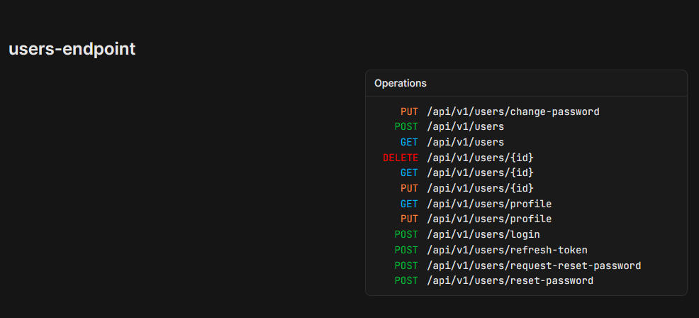
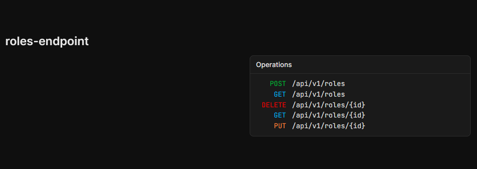
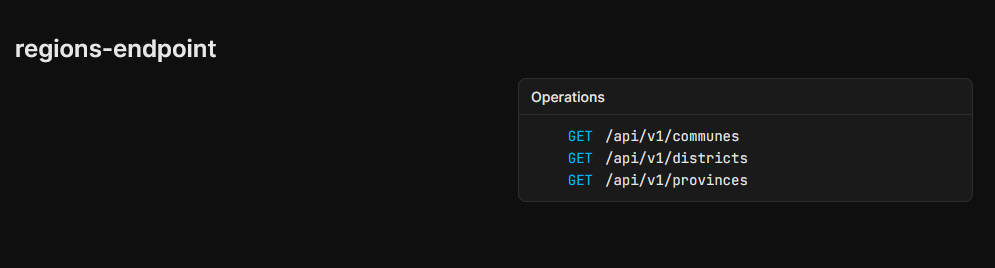
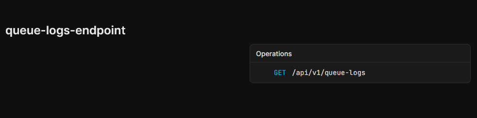
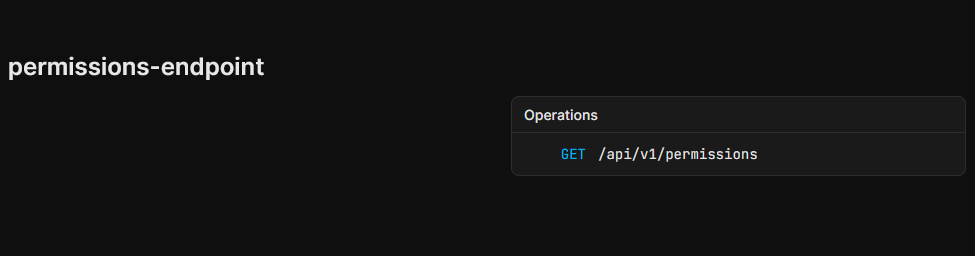
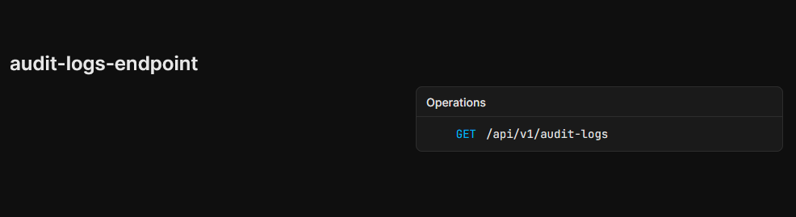

# Clean Architecture The Template

[English](README.md) | [Vietnamese](README-VIETNAMESE.md)

#


[](LICENSE)


[](https://www.nuget.org/packages/minhsangdotcom.TheTemplate.SharedKernel)
[](https://www.nuget.org/packages/TranMinhSang.DynamicQueryExtension.EntityFrameworkCore)
[](https://www.nuget.org/packages/minhsangdotcom.TheTemplate.SpecificationPattern/)
[](https://www.nuget.org/packages/TranMinhSang.Specification.EntityFrameworkCore/)
[](https://www.nuget.org/packages/minhsangdotcom.TheTemplate.ElasticsearchFluentConfig/)
[](https://www.nuget.org/packages/TranMinhSang.AspNetCore.Extensions/)

# Bảng nội dung <div id= "bang-noi-dung"/>

- [Ngôn ngữ](#)
- [Nhãn](#)
- [Bảng nội dung](#bang-noi-dung)
- [Giới thiệu](#gioi-thieu)
- [Cho mình 1 ⭐ nhé](#cho-minh-sao-nhe)
- [Định Nghĩa](#dinh-nghia)
  - [Lợi ích](#lợi-ích)
  - [Nhược điểm](#nhược-điểm)
- [Tính năng :rocket:](#tinh-nang)
- [Nhá hàng cho các tính năng :fire:](#nha-hang-cho-cac-tinh-nang)
  - [Api](#api)
  - [Truy vết](#truy-vet)
  - [Lưu trử file media bằng Minio](#minio-storage)
- [Sơ lượt về Cấu trúc :mag_right:](#so-luot-ve-cau-truc)
- [Bắt đầu thôi nào](#bắt-đầu-thôi-nào)
  - [Cách để chạy ứng dụng](#cách-để-chạy-ứng-dụng)
  - [Hướng dẫn sử dụng](#hướng-dẫn-sử-dụng)
    - [Authorize](#authorize)
    - [Thêm một quyền mới vào ứng dụng](#thêm-một-quyền-mới-vào-ứng-dụng)
    - [Bộ lọc](#bộ-lọc)
    - [Phân trang](#phân-trang)
- [Khởi tạo dữ liệu mặc định](#seeding)
- [Dịch lỗi](#TranslationError)
- [Công nghệ](#công-nghệ)
- [Hỗ trợ](#hỗ-trợ)
- [Lời cảm ơn](#lời-cảm-ơn)
- [Cấp phép](#cấp-phép)
<div id="gioi-thieu" />

# Giới thiệu

Template này được thiết kế dành cho các bạn backend làm việc với ASP.NET Core. Nó cung cấp một cách hiệu quả để xây dựng các ứng dụng enterprise một cách đơn giản bằng cách tận dụng lợi thế từ kiến trúc Clean Architecture và .NET Core framework.

<div id='cho-minh-sao-nhe'/>

# Cho mình 1 ⭐ nhé

Nếu bạn thấy template này hữu ích và học được điều gì đó từ nó, hãy cân nhắc cho mình một :star:.

Sự hỗ trợ của bạn là động lực giúp mình mang đến những tính năng mới và cải tiến tốt hơn trong các phiên bản sắp tới.

<div id ="dinh-nghia"/>

# Định Nghĩa

Kiến trúc Sạch (Clean Architecture) là một phương pháp thiết kế phần mềm do Robert C. Martin (Uncle Bob) giới thiệu, nhấn mạnh vào thuật ngữ "Tách biệt các thành phần",các tầng ngoài cùng sẽ phụ thuộc vào các tầng bên trong như hình minh họa. Tầng core sẽ không phụ thuộc vào các framework bên ngoài, cơ sở dữ liệu hay giao diện người dùng, từ đó giúp hệ thống dễ bảo trì, kiểm thử và phát triển theo thời gian.


### Lợi ích

- **Các thành phần tách biệt**: Mỗi một tầng chịu trách nhiệm cho một khía cạnh của ứng dụng, giúp mã dễ hiểu và bảo trì.
- **Dễ dàng kiểm thử**: Các business logic được tách biệt khỏi framework và UI, việc kiểm thử đơn vị trở nên đơn giản và đáng tin cậy hơn.
- **Linh hoạt và Thích nghi**: Khi thay đổi framework, cơ sở dữ liệu hoặc các hệ thống bên ngoài ít ảnh hưởng đến logic của phần core.
- **Tái sử dụng**: Các Business rules có thể được tái sử dụng trong các ứng dụng hoặc hệ thống khác mà không phải thay đổi quá nhiều code.
- **Khả năng mở rộng**: Cấu trúc rõ ràng hỗ trợ việc phát triển và thêm tính năng mới mà không cần tái cơ cấu lại.
- **Không phụ thuộc vào framework**: Không bị phụ thuộc nhiều vào framework, rất dễ dàng để thanh đổi công nghệ mới.

### Nhược điểm

- **_Phức tạp_**: Cấu trúc các tầng có thể tăng tính phức tạp, đặc biệt đối với các dự án nhỏ nơi các kiến trúc đơn giản hơn có thể phù hợp hơn
- **_Chi phí khởi đầu cao_**: Thiết lập Kiến Trúc Sạch yêu cầu thêm nỗ lực để tổ chức các tầng và tuân theo các nguyên tắc thiết kế nghiêm ngặt.
- **_Khó khăn khi học tập_**: Các developer không quen thuộc với nguyên tắc này có thể mất thời gian để hiểu rõ cấu trúc và lợi ích của nó.
- **_Nguy cơ về cấu trúc quá phức tạp_**: Đối với các ứng dụng nhỏ, các tầng bổ sung có thể không cần thiết và dẫn đến sự phức tạp hóa.
- **_Hiệu năng bị suy giảm_**: Sự trích dẫn và trừa tượng(interface) giữa các tầng có thể giảm hiệu năng, tuy nhiên thường là không đáng kể.
<div id='tinh-nang'/>

# Tính năng :rocket:

Có gì đặc biệt khiến cho template này trở nên khác biệt so với những template khác có trên Github?

### Tính năng cần thiết cho mọi dự án:

- Đăng nhập :lock:
- Xác thực người dùng (Role, Permission) :shield:
- Refresh token :arrows_counterclockwise:
- Đổi mật khẩu :repeat:
- Quên mật khẩu :unlock:
- Audit log :clipboard:
- Quản lý người dùng :busts_in_silhouette:
- Quản lý vai trò :shield:

### Một số tính năng hữu ích khác:

1. [DDD (Domain Driven Design)](/src/Domain/Aggregates/) :brain:
1. [CQRS & Mediator](/src/Application/Features/) :twisted_rightwards_arrows:
1. [Cross-cutting concern](/src/Application/Common/Behaviors/) :scissors:
1. [Mail Sender](/src/Infrastructure/Services/Mail/) :mailbox:
1. [Caching (Memory & Distributed)](/src/Infrastructure/Services/Cache/) :computer:
1. [Queue](/src/Infrastructure/Services/Queue/) [Example at feature/TicketSale](https://github.com/minhsangdotcom/clean-architecture/tree/feature/TicketSale) :walking:
1. [Logging](/src/Api/Extensions/SerialogExtension.cs) :pencil:
1. [Tracing](/src/Api/Extensions/OpenTelemetryExtensions.cs) :chart_with_upwards_trend:
1. [Hỗ trợ dịch đa ngôn ngữ](src/Api/Resources/) :globe_with_meridians:
1. [S3 AWS](/src/Infrastructure/Services/Aws/) :cloud:
1. [Elasticsearch](/src/Infrastructure/Services/Elasticsearch/) :mag:
1. [Docker deployment](/Dockerfile) :whale:
<div id= 'nha-hang-cho-cac-tinh-nang'/>

# Nhá hàng cho các tính năng :fire:

### API

<p align="center">
  
  
  
  
  
  
</p>

<div id='truy-vet'/>

### Truy Vết

<p align="center">
  
</p>

<div id='minio-storage'/>

### Lưu trử file media bằng Minio

<p align="center">
  
</p>

<div id='so-luot-ve-cau-truc'/>

# Sơ lượt về Cấu trúc :mag_right:

```
/Domain
  ├── /Aggregates/           # Các Aggregate trong Domain (entity chứa quy tắc nghiệp vụ)
  └── /Common/               # Logic domain dùng chung
```

```
/Application
  ├── /Common
  │     ├── /Auth/                   # Tiện ích xác thực & phân quyền (xây dựng policy, trích xuất claim)
  │     ├── /Behaviors/              # MediatR pipeline behaviors (logging, validation, transaction, caching)
  │     ├── /ErrorCodes/             # Định nghĩa mã lỗi tập trung cho toàn bộ ứng dụng
  │     ├── /Errors/                 # Ánh xạ kết quả lỗi & problem details
  │     ├── /Interfaces/             # Interface tầng Application (service, repository, abstraction)
  │     ├── /RequestHandler/         # Phân tích, validate & chuẩn hóa query parameters
  │     ├── /Security/               # Tiện ích bảo mật (attribute phân quyền, metadata role)
  │     └── /Validators/             # Lớp abstract FluentValidation dùng chung
  │
  ├── /Features                      # Phong cách Vertical Slice (CQRS + MediatR)
  │     ├── /AuditLogs/              # Command & Query quản lý audit log
  │     ├── /Permissions/            # Quản lý permission
  │     ├── /QueueLogs/              # Log truy vấn cho background queue jobs
  │     ├── /Regions/                # CQRS xử lý theo khu vực (region)
  │     ├── /Roles/                  # CRUD role + command role-permission
  │     └── /Users/                  # CRUD user + các thao tác tài khoản
  │
  ├── /SharedFeatures                # Các thành phần CQRS dùng chung cho nhiều feature
  │     ├── /Mapping/                # Mapping dùng chung giữa nhiều feature
  │     ├── /Projections/            # DTO phía read-side hoặc view model nhẹ dùng chung
  │     ├── /Requests/               # Command/Query dùng chung (ví dụ: Upsert dùng cho nhiều nghiệp vụ)
  │     └── /Validations/            # Rule FluentValidation tái sử dụng giữa nhiều command/query
  │
  ├── Application.csproj             # File project Application
  └── DependencyInjection.cs         # Đăng ký toàn bộ service tầng Application vào DI container
```

```
/Infrastructure
  ├── /Common                          # Các thành phần dùng chung ở tầng Infrastructure
  │
  ├── /Constants                       # Các hằng số tĩnh cho tầng Infrastructure
  │
  ├── /Data                            # EF Core + tầng lưu trữ dữ liệu (persistence)
  │     ├── /Configurations/           # Cấu hình entity bằng Fluent API
  │     ├── /Converters/               # Bộ chuyển đổi kiểu (ví dụ: Ulid ↔ string)
  │     ├── /Interceptors/             # Interceptor của EF Core (audit, logging)
  │     ├── /Migrators/                # Các file migration của EF Core
  │     ├── /Repositories/             # Triển khai repository
  │     └── /Seeders/                  # Dữ liệu seed để khởi tạo cơ sở dữ liệu
  │
  ├── /Services                        # Các triển khai service ở tầng Infrastructure
  │
  ├── DependencyInjection.cs           # Đăng ký các service của Infrastructure vào DI
  └── Infrastructure.csproj            # File project

```

```
/Api
  ├── /common                           # Helper / tiện ích dùng chung cho tầng API
  │
  ├── /Converters                       # Các converter cho project
  │
  ├── /Endpoints                        # Định nghĩa HTTP endpoint (Minimal API)
  │
  ├── /Extensions                       # Extension methods cho API (Swagger, CORS, routing, ...)
  │
  ├── /Middlewares                      # Middleware custom (xử lý exception, logging, ...)
  │
  ├── /Resources                        # Tài nguyên localization cho message
  │     ├── /Messages/                  # File message đa ngôn ngữ (vd: en.json, vi.json)
  │     └── /Permissions/               # File dịch permission
  │
  ├── /Services                         # Service riêng cho tầng API (nếu có logic đặc thù API)
  │
  ├── /Settings                         # Setting cho IOptions
  │
  ├── /wwwroot/Templates                # File template tĩnh (email, export, ...)
  │
  ├── Api.csproj                        # File project API
  └── Program.cs                        # Điểm khởi động ứng dụng
```

```
            +-----------------------------------------------+
            |                   Api                         |
            +-----------------------------------------------+
             |                     |                    |
             |                     |                    |
             ↓                     |                    |
        +------------------+       |                    |
        |  Infrastructure  |       |                    |
        +------------------+       |                    |
                        |          |                    |
                        ↓          ↓                    ↓
                    +--------------------+    +----------------------+
                    |   Application      | -> | Application.Contracts|
                    +--------------------+    +----------------------+
                             |
                             ↓
            +---------------------------+
            |          Domain           |
            +---------------------------+

```

# Bắt đầu thôi nào

## Cách để chạy ứng dụng

Các thứ cần để chạy ứng dụng:

- [.NET 10](https://dotnet.microsoft.com/en-us/download/dotnet/10.0)
- [Docker](https://www.docker.com/)

Bước thứ 1 :point_up: :

Tạo 1 file tên appsettings.Development.json ở ngoài cùng của tầng Api, Sao chép nội dung của appsettings.example.json vào file mới tạo và sau đó điều chỉnh lại các cấu hình theo cách của bạn.

Template hỗ trợ **nhiều hệ quản trị cơ sở dữ liệu quan hệ** và cho phép chuyển đổi giữa chúng thông qua cấu hình.

Hiện tại, provider mặc định là **PostgreSQL**.

```json
"DatabaseSettings": {
  "Provider": "PostgreSQL",
  "Relational": {
    "PostgreSQL": {
      "ConnectionString": "Host=localhost;Port=5432;Username=postgres;Password=1;Database=the_database"
    }
  }
}
```

Cập nhật migration lên database

```
cd src/Infrastructure

dotnet ef database update
```

Bước tiếp theo nha :point_right::

```
cd Dockers/MinioS3

```

Đổi tên username và password ở file .env nếu cần thiết, lát nữa các bạn sẽ dùng nó để đăng nhập vào web manager đó.

```
MINIO_ROOT_USER=minioadmin
MINIO_ROOT_PASSWORD=Admin@123
```

Dùng lệnh sau đây để chạy Amazon S3 service

```
docker-compose up -d
```

Phiên bản docker compose cũ

```
docker-compose up -d
```

Truy cập http://localhost:9001 và đăng nhập


Tạo ra cặp key


Chỉnh lại setting ở your appsettings.json

```json
"AmazonS3Settings": {
  "ServiceUrl": "http://localhost:9000",
  "AccessKey": "",
  "SecretKey": "",
  "BucketName": "the-template-project",
  "PreSignedUrlExpirationInMinutes": 1440,
  "Protocol": 1
},
```

Bước cuối nha

```
cd src/Api
dotnet run

```

vào swagger ui ở http://localhost:8080/swagger

Tài khoản admin mặc định là <ins>username:</ins> <b>chloe.kim</b>, <ins>password</ins>: <b>Admin@123</b>

Xong rồi đó :tada: :tada: :tada: :clap:

## Hướng dẫn sử dụng

### Authorize

Gọi hàm `MustHaveAuthorization` để xác thực người dùng bằng vai trò, quyền, hoặc cả 2.
Có 2 tham số là permissions và roles đều là kiểu string và ngăn cách bằng dấu phẩy.

```csharp
public void MapEndpoint(IEndpointRouteBuilder app)
{
    app.MapPost(Router.RoleRoute.Roles, HandleAsync)
        .WithTags(Router.RoleRoute.Tags)
        .AddOpenApiOperationTransformer(
            (operation, context, _) =>
            {
                operation.Summary = "Create role 👮";
                operation.Description = "Creates a new role and assigns permission IDs.";
                return Task.CompletedTask;
            }
        )
        .WithRequestValidation<CreateRoleCommand>()
        .MustHaveAuthorization(
            permissions: PermissionGenerator.Generate(
                PermissionResource.Role,
                PermissionAction.Create
            )
        );
}
```

**_Tạo ra role kèm theo permission_**

```json
{
  "name": "string",
  "description": "string",
  "permissionIds": ["01KCB884CW3JKVQT09M5ME06VH"]
}
```

### Thêm một quyền mới vào ứng dụng

Tất cả quền được khởi tạo ở

```
cd src/Application.Contracts/Permissions/
```

Đăng ký tất cả permission vào file **`SystemPermissionDefinitionProvider`**.  
Đầu tiên tạo ra **permission group** sau đó thêm vào một hoặc nhiều quyền vào group đó.

```csharp
#region Role permission
PermissionGroupDefinition roleGroup =
    context.AddGroup("RoleManagement", "Role Management");

roleGroup.AddPermission(
    PermissionNames.PermissionGenerator.Generate(
        PermissionNames.PermissionResource.Role,
        PermissionNames.PermissionAction.List
    ),
    "View list role"
);
#endregion

```

#### Cấu trúc quyền

```
  {Resource}.{Action}
```

VD:

- Role.List
- Role.Create

#### Tạo mới action và resource

Tất cả action và resource sử dụng cho việc tạo permission đều nằm trong PermissionNames.cs

```csharp
public class PermissionAction
{
    public const string Create = nameof(Create);
    public const string Update = nameof(Update);
    public const string Delete = nameof(Delete);
    public const string Detail = nameof(Detail);
    public const string List = nameof(List);
    public const string Test = nameof(Test);
    public const string Test1 = nameof(Test1);
}

public class PermissionResource
{
    public const string User = nameof(User);
    public const string Role = nameof(Role);
    public const string QueueLog = nameof(QueueLog);
}
```

#### Cơ chế quyền Kế thừa

Hệ thống hỗ trợ kế thừa quyền, nghĩa là khi một quyền cấp cao hơn được cấp cho người dùng thì họ sẽ tự động có luôn các quyền cấp thấp hơn bên dưới.

Vd: người dùng có chỉ có quyền role.update nhưng muốn truy cập api có quyền role.list, vẫn chấp nhận vì quyền cha sẽ bao gồm các quyền con:

- **Update** bao gồm **Detail** và **List**
- **Detail** bao gồm **List**
- **List**

Cơ chế này giúp bạn chỉ cần cấp 1 quyền (vd role.update) thay vì cấp nhiều quyền như role.list,role.detail cho một vai trò hay người dùng cụ thể.

#### Cách Quyền được lưu trử

- **Parent permissions** (quyền ở cấp root) khởi tạo ở `SystemPermissionDefinitionProvider` được lưu ở Db

- **Child permissions** lưu ở bộ nhớ ram hệ thống **không lưu ở DB**

<div id='filtering'/>

### Bộ lọc

Để thực hiện tính năng filter, Chúng ta sẽ sử dụng cú pháp LHS Brackets.

LHS là cách để sử dụng các phương thức trong dấu ngoặc vuông cho key

VD:

```
GET api/v1/users?filter[dayOfBirth][$gt]="1990-10-01"
```

Ví dụ này nói rằng hãy lấy ra cho tôi tất cả những người có ngày sinh sau ngày 01 tháng 10 năm 1990

Tất cả các phương thức:

| Operator      | Description                                |
| ------------- | ------------------------------------------ |
| $eq           | So sánh bằng                               |
| $eqi          | So sánh bằng (Không phân biệt hoa thường)  |
| $ne           | Không bằng                                 |
| $nei          | Không bằng (Không phân biệt hoa thường)    |
| $in           | Lọc ra các kết quả Có trong mảng này       |
| $notin        | Lọc ra các kết quả không Có trong mảng này |
| $lt           | Bé hơn                                     |
| $lte          | Bé hơn bằng                                |
| $gt           | Lớn hơn                                    |
| $gte          | Lớn hơn hoặc bằng                          |
| $between      | Kết quả nằm giữa 2 phần tử trong mảng      |
| $notcontains  | không chứa                                 |
| $notcontainsi | không chưa (Không phân biệt hoa thường)    |
| $contains     | chứa                                       |
| $containsi    | chứa (Không phân biệt hoa thường)          |
| $startswith   | phần đầu khớp với                          |
| $endswith     | phần cuối khớp với                         |

Vài VD:

```
GET /api/v1/user?filter[gender][$in][0]=1&filter[gender][$in][1]=2
```

```
GET /api/v1/user?filter[gender][$between][0]=1&filter[gender][$between][1]=2
```

```
GET /api/v1/user?filter[firstName][$contains]=abc
```

Phương thúc $and và $or:

```
GET /api/v1/users/filter[$and][0][firstName][$containsi]="sa"&filter[$and][1][lastName][$eq]="Tran"
```

```JSON
{
  "filter": {
    "$and": {
      "firstName": "sa",
      "lastName": "Tran"
    }
  }
}
```

```
GET /api/users/filter[$or][0][$and][0][claims][claimValue][$eq]=admin&filter[$or][1][lastName][$eq]=Tran
```

```JSON
{
    "filter": {
        "$or": {
            "$and":{
                "claims": {
                    "claimValue": "admin"
                }
            },
            "lastName": "Tran"
        }
    }
}
```

Các bạn có thể tìm hiểu thêm ở một số link sau đây

[https://docs.strapi.io/dev-docs/api/rest/filters-locale-publication#filtering](https://docs.strapi.io/dev-docs/api/rest/filters-locale-publication#filtering)\
[https://docs.strapi.io/dev-docs/api/rest/filters-locale-publication#complex-filtering](https://docs.strapi.io/dev-docs/api/rest/filters-locale-publication#complex-filtering)\
[https://docs.strapi.io/dev-docs/api/rest/filters-locale-publication#deep-filtering](https://docs.strapi.io/dev-docs/api/rest/filters-locale-publication#deep-filtering)

Mình thiết kế input đầu vào dựa trên [Strapi filter](https://docs.strapi.io/dev-docs/api/rest/filters-locale-publication)

Mình đã nhúng sẳn filter tự động vào tất cả các hàm lấy danh sách chỉ cần gọi

```csharp
unitOfWork.ReadonlyRepository<User>()
```

<div id='pagination'/>

### Phân trang

Offset and cursor pagination được tích hợp sẳn trong template.

Để sử dựng offset pagination thêm dòng sau vào code

```csharp
var response = await unitOfWork
    .ReadonlyRepository<User>(true)
    .PagedListAsync(
        new ListUserSpecification(),
        query,
        ListUserMapping.Selector(),
        cancellationToken: cancellationToken
    );
```

Để sử dụng cursor pagination thêm dòng sau vào code

```csharp
var response = await unitOfWork
    .ReadonlyRepository<User>(true)
    .CursorPagedListAsync(
        new ListUserSpecification(),
        query,
        ListUserMapping.Selector(),
        cancellationToken: cancellationToken
    );
```

```json
{
  "results": {
    "data": [
      {
        "firstName": "sang",
        "lastName": "minh",
        "username": "sang.minh123",
        "email": "sang.minh123@gmail.com",
        "phoneNumber": "0925123320",
        "dayOfBirth": "1990-01-09T17:00:00Z",
        "gender": 2,
        "avatar": null,
        "status": 1,
        "createdBy": "01JD936AXSDNMQ713P5XMVRQDV",
        "updatedBy": "01JD936AXSDNMQ713P5XMVRQDV",
        "updatedAt": "2025-04-16T14:26:01Z",
        "id": "01JRZFDA1F7ZV4P7CFS5WSHW8A",
        "createdAt": "2025-04-16T14:17:54Z"
      }
    ],
    "paging": {
      "pageSize": 1,
      "totalPage": 3,
      "hasNextPage": true,
      "hasPreviousPage": false,
      "before": null,
      "after": "q+blUlBQci5KTSxJTXEsUbJSUDIyMDLVNTDRNTQLMTK0MjS3MjXRMzG3tDAx1DYwtzIwUNIB6/FMASk2MPQKinJzcTR0M48KMwkwd3YLNg0P9gi3cFTi5aoFAA=="
    }
  },
  "status": 200,
  "message": "Success"
}
```

<div id='seeding'/>

### Khởi tạo dữ liệu mặc định

```
cd Infrastructure/Data/Seeders/
```

<div id='TranslationError'/>

### Dịch lỗi

Để dịch các thông điệp lỗi, tên quyền hoặc tên vai trò, làm theo các bước sau:

1. **Định nghĩa mã lỗi (error code)**  
   Thêm một file mới trong thư mục `ErrorCodes` (ví dụ: `UserErrorMessages.cs`, `RoleErrorMessages.cs`) tại  
   `Application/Common/ErrorCodes/`.

2. **Thêm mã lỗi vào file dịch**  
   Vào API layer → `Resources/` và thêm mã lỗi (hoặc tên quyền/tên vai trò) và bản dịch vào file JSON tương ứng  
   (ví dụ: `Permissions.en.json`, `Messages.vi.json`).

3. **(Tùy chọn nhưng khuyến dùng) Đồng bộ hóa dữ liệu dịch**  
   Sau khi chỉnh sửa bản dịch (thêm mới hoặc xóa) gọi endpoint để tự động thêm các mục còn thiếu và xóa các mục không còn sử dụng:

   ```rest
   GET /api/localizations/sync
   ```

# Công nghệ

- .NET 10
- EntityFramework core 10
- PostgresSQL
- FluentValidation
- Mediator
- XUnit, Shouldly, Respawn
- OpenTelemetry
- Serilog
- Redis
- ElasticSearch
- Aws S3
- Docker
- GitHub Workflow

# Hỗ trợ

Nếu như có bất kì vấn đề nào thì cho mình biết qua [phần issue ](https://github.com/minhsangdotcom/clean-architecture/issues) nhé.

# Lời cảm ơn

- [Clean architecture by Jayson Taylor](https://github.com/jasontaylordev/CleanArchitecture)

- [Clean architecture by amantinband](https://github.com/amantinband/clean-architecture)
- [Clean architecture by Ardalis](https://github.com/ardalis/CleanArchitecture)
- [Specification pattern](https://github.com/ardalis/Specification)
- [REPR Pattern](https://github.com/ardalis/ApiEndpoints)
- [Clean testing by Jayson Taylor](https://github.com/jasontaylordev/CleanArchitecture/tree/main/tests)
<div id="license"/>

# Cấp phép

Dự án này sử dụng [MIT license](LICENSE).
